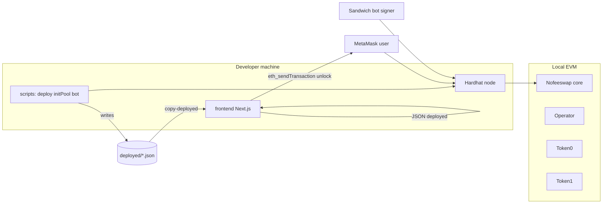

# NoFeeSwap Local Assignment — Presentation

Use this document as **speaker notes**, an **interview walkthrough**, or the basis for **slides** (one main `##` section ≈ one slide).

---

## 1. Title & agenda

**Title:** NoFeeSwap on a local chain — deploy, dApp, mempool sandwich demo

**What this project is:** A **single repository** that (1) deploys the real **NoFeeSwap core + operator** stack on **Hardhat**, (2) exposes a **Next.js + wagmi** UI for pool setup, liquidity, and swaps, and (3) runs a **TypeScript bot** that watches the **pending pool** and demonstrates **sandwich-style ordering** with **EOA transactions** and **gas price ladder** — all on **localhost**.

**Agenda (suggested ~15–25 min):**

1. Goals & scope (what the assignment asked for)  
2. Repository layout (frontend vs chain tooling)  
3. On-chain layer: deploy, pool init, encoding  
4. Frontend: wallet, pool init UI, liquidity, swap + estimates  
5. Bot: mempool, decode, frontrun / victim / backrun  
6. Trade-offs, limitations, what I’d improve  
7. Live demo checklist  

---

## 2. Assignment goals (mapping)

| Theme | What we deliver |
|--------|------------------|
| **Local chain** | Hardhat node, chain id **31337**, RPC `127.0.0.1:8545` |
| **Protocol** | **nofeeswap-core** + **nofeeswap-operator** compiled and deployed (CREATE3 pattern, operator set, mock ERC-20s) |
| **Pool** | Initialized via script (`initPool.ts`) and/or **UI** (`dispatch(initialize(...))`) |
| **dApp** | MetaMask, **pending / confirmed / reverted** feedback, pool init, mint/burn, swap + slippage + **spot estimates** |
| **Bot** | `pending` subscription, calldata decode, **three-step** sandwich **simulation** (EOA + gas ordering) |
| **Reproducibility** | **README**, **STRUCTURE.md**, commands copy-pasteable |

**Transparency:** Anything that is **approximate** (quotes, LP position in browser) is **documented** in the README — important for a senior interview.

---

## 3. High-level architecture

**One sentence:** The **frontend** never talks to a custom backend server — it talks to **MetaMask**, which talks to **Hardhat**; **scripts** and the **bot** also talk to the **same node** over HTTP/WebSocket.

---

## 4. Repository layout (mental model)

| Area | Path | Role |
|------|------|------|
| **Frontend** | `frontend/` | Next.js 15, `app/`, `components/`, `hooks/`, `lib/`, static `public/deployed/` |
| **Chain tooling** | `hardhat.config.ts`, `contracts/`, `scripts/` | Compile, deploy, init pool, sandwich bot |
| **Outputs** | `deployed/` | `addresses.json`, `pool.json` — **source of truth** before copying to the UI |
| **UI copy of config** | `frontend/public/deployed/` | Filled by **`npm run copy-deployed`** from repo root |
| **Upstream** | `nofeeswap-core/`, `nofeeswap-operator/` | Vendored protocol sources |

Details: see **`STRUCTURE.md`** in the repo root.

---

## 5. On-chain layer — deploy & pool initialization

### 5.1 Deploy (`scripts/deploy.ts`)

- Deploys **Deployer** (CREATE3), **delegatee**, **Nofeeswap** singleton, **mock hook**, **Operator**, **two ERC-20s** (ordered as **token0 &lt; token1**).
- Runs **modifyProtocol** and **setOperator** as in upstream patterns.
- Writes **`deployed/addresses.json`** (nofeeswap, operator, delegatee, tokens, **poolGrowthPortion**, etc.).

### 5.2 Scripted pool init (`scripts/initPool.ts`)

- Builds **curve** and **kernel** (same spirit as upstream tests / `SwapData_test`-style data).
- **`dispatch(initialize(...))`** from the pool owner path used in tests.
- Optional **initial mint** via **`unlock(operator, mintSequence)`**.
- Writes **`deployed/pool.json`** (pool id, curve, ticks, tagShares, etc.).

### 5.3 Encoding (shared idea)

- **`scripts/lib/nofee*.ts`** — operator **unlock** bytecode sequences (mint, burn, swap).
- **`frontend/lib/`** — parallel copies for the browser (no Hardhat in the browser).

**Why two copies:** Keeps the UI self-contained; a production repo might publish a small **`@nofee/encoding`** package instead.

---

## 6. Frontend — user journey

### 6.1 Prerequisites in the browser

1. Load **`/deployed/addresses.json`** and **`/deployed/pool.json`** (from `public/deployed/`).
2. User connects **MetaMask** to **chain 31337**.
3. If the chain was reset, the UI detects **empty code** at known addresses and shows a **redeploy + copy-deployed** message.

### 6.2 Features (by screen area)

| Feature | Behavior |
|---------|----------|
| **Wallet** | Connect / disconnect; chain pill (correct vs wrong network). |
| **Initialize pool** | Form: sqrt price, log offset, **pool nonce** (uniqueness), kernel points; **`dispatch(initialize)`**; optional **kernel chart** preview. |
| **Liquidity** | Tick range, mint/burn shares; **`unlock`** + **mintSequence** / **burnSequence**; **position summary** stored in **localStorage** (demo choice — not an indexer). |
| **Swap** | Direction, amount (wei), slippage (bps); **spot-based estimate** (not an on-chain quoter — clearly labeled); **`unlock`** + **swapSequence**; status line for tx phases. |

### 6.3 Transaction path (swap)

1. Ensure allowance to **operator** (approve if needed).
2. Call **`Nofeeswap.unlock(operator, data)`** where `data` is the **swapSequence** bytes (same entrypoint the operator stack uses in tests).

---

## 7. Sandwich bot — design

### 7.1 Purpose (assignment scope)

Demonstrate **mempool awareness**, **calldata parsing**, and **transaction ordering** via **gas price**, not a production MEV contract.

### 7.2 Steps the script takes

1. **`evm_setAutomine(false)`** so txs can sit pending.
2. **WebSocket** `pending` on `ws://127.0.0.1:8545`.
3. For each hash: **`getTransaction`**, filter **`to === Nofeeswap`**, selector **`unlock(address,bytes)`**.
4. Decode inner bytes: extract **`amountSpecified`** (and related fields) from the **swapSequence** layout; log **implied slippage vs mid** from parsed limit vs pool curve when possible.
5. Submit **frontrun** (higher **gasPrice**), let **victim** land, **backrun** (lower gas) — **EOA** flow.

### 7.3 Hardhat caveat

Local “mempool” behavior is **not identical** to mainnet; you may need **`evm_mine`** to advance blocks during a demo — documented in the README.

---

## 8. Data artifacts (`deployed/`)

| File | Contents |
|------|-----------|
| **`addresses.json`** | Contract addresses, tokens, delegatee, pool growth portion, etc. |
| **`pool.json`** | Pool id, curve, kernel info, ticks, tagShares from scripted init |

**Rule:** After any **chain reset**, redeploy, re-init, run **`npm run copy-deployed`**, refresh the UI.

---

## 9. Trade-offs & limitations (say these out loud)

| Topic | Choice |
|-------|--------|
| **Swap “quote”** | **Curve mid + math** — fast, no quoter contract deployed; **not** execution-accurate. |
| **LP position** | **localStorage** — simple demo; production would read **events** or **subgraph**. |
| **Kernel UI** | **Two-segment** editable preview — not a full YellowPaper authoring tool. |
| **Bot profitability** | **Ordering demo**, not optimized PnL math. |
| **Anvil** | README notes **Hardhat** is used; Anvil is optional parity. |

This shows **judgment** and **honesty** — strong for a senior loop.

---

## 10. Live demo script (recommended order)

**Terminals:** T1 chain, T2 deploy, T3 UI (optional T4 bot).

1. **T1:** `npx hardhat node`  
2. **T2:** `npx hardhat compile` (if needed) → `npm run deploy` → `npm run init-pool` → `npm run copy-deployed`  
3. **T3:** `npm run dev:ui` (or `cd frontend && npm run dev`)  
4. Browser: MetaMask **31337**, import test key, **connect**, show **swap** (and optionally **init** / **liquidity**).  
5. **T4:** `npm run bot` — with automine off, submit a **swap** from the UI, show **logs** (amount, implied bps), optionally **`evm_mine`** if blocks don’t advance.

---

## 11. Closing lines (30 seconds)

- **Single repo**, clear split: **`frontend/`** vs **Hardhat + `scripts/`**.  
- **Real protocol** deployment paths, **operator unlock** sequences aligned with tests.  
- **Transparent** about approximations (**estimates**, **local LP state**, **local mempool**).  
- **Next steps** with more time: on-chain **quoter** or **staticcall** strategy, **indexed** positions, **Anvil** parity scripts, **hard tests** for encoding round-trips.

---

## 12. Optional Q&A bank

- **Why not a quoter contract?** Operator deploy used **zero** quoter address; estimates are **documented** as spot-based.  
- **Why localStorage for LP?** Scope/time; easy to **replace** with RPC/event index.  
- **Is the bot profitable?** Not the goal — **ordering + decode + gas** demonstrate the **off-chain** skill set.  
- **Security?** **Localhost + test keys only** — never reuse on mainnet.

---

*End of presentation notes.*
